# Risky-Business
In this assignment, several machine learning models were built and evaluated to predict credit risk using data from lending services.  Different techniques for training and evaluating models with imbalanced classes were employed. The imbalanced-learn and Scikit-learn librarie and Resampling and Ensemble-learning were used in this assignment. 

## Resampling

Used the imbalanced learn library to resample the lending_data and built and evaluated logistic regression classifiers using the resampled data.
After reading the CSV into a DataFrame, split the data into training and testing sets using 'train_test_split' from 'sklearn.model_selection'. Scaled the training and testing data using the `StandardScaler` from `sklearn.preprocessing`. Then run the following models:

### Simple Logistic Regression 
balanced accuracy score: 0.9892813049736127

confusion matrix:

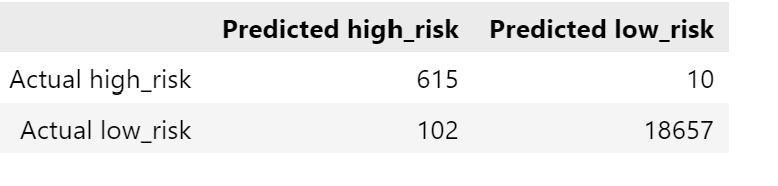

imbalanced classification report:

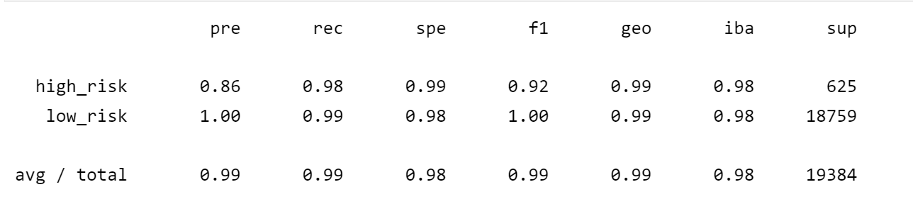

### Naive Random Oversampler
balanced accuracy score: 0.9946414201183431

confusion matrix:

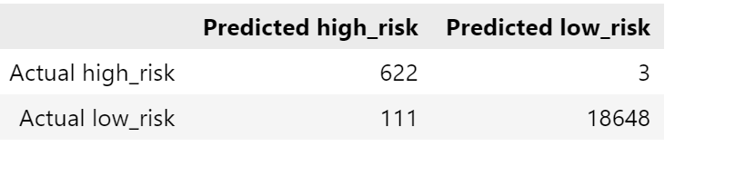

imbalanced classification report:

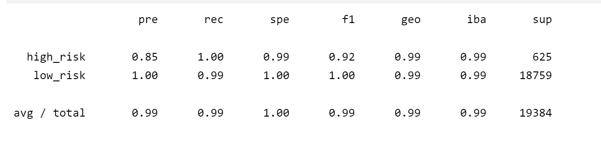

### SMOTE
balanced accuracy score:0.9946680739911509

confusion matrix:

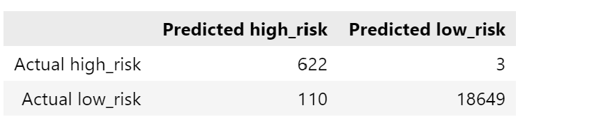

imbalanced classification report:

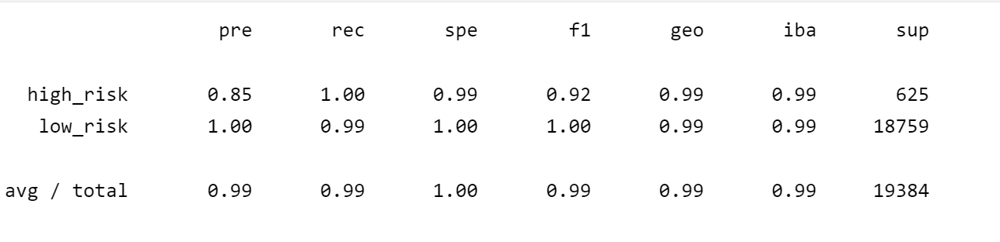

### Cluster Centroids
balanced accuracy score:0.9932813049736127

confusion matrix:

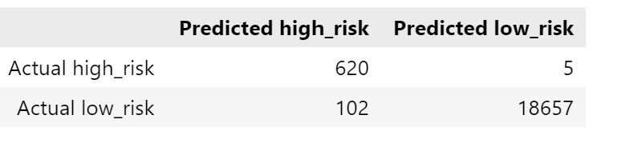

imbalanced classification report:

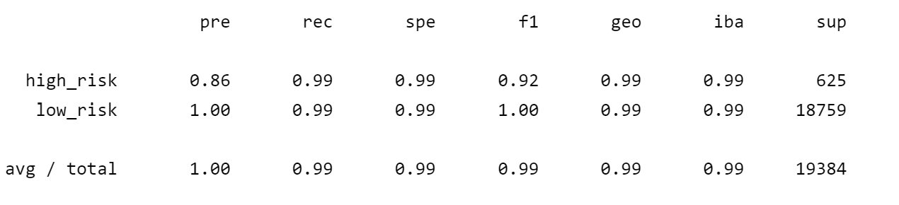

### SMOTEENN 
balanced accuracy score:0.9946680739911509

confusion matrix:

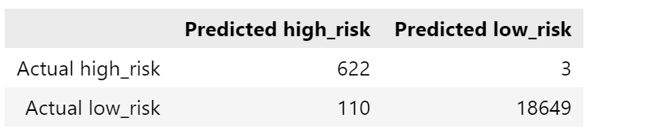

imbalanced classification report:

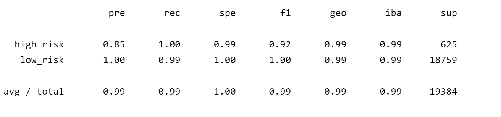

From above results, we know that SMOTE Oversampling and Combination Sampling had the best balanced accuracy score. Both of them were .9946680739911509.
Comination Sampling, SMOTE Oversampling and Naive Random Sampling had the best recall score. 1 for high risk and 0.99 for low risk.All models had the same geometric mean score which was 0.99. 

## Ensemble Learning

Predicted loan risk using the Balanced Random Forest Classifier and the Easy Ensemble Classifier. After reading, spliting, and scaling the data, ran the following models:

### Balanced Random Forest Classifier
balanced accuracy score:0.8025107670490026

confusion matrix:

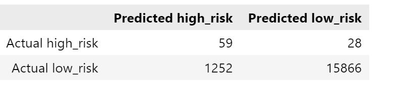

imbalanced classification report:

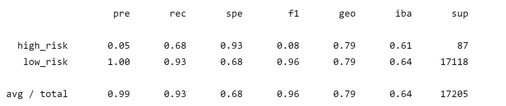

### Easy Ensemble Classifier
balanced accuracy score:0.9263620468069506

confusion matrix:

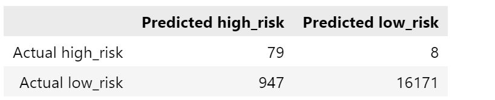

imbalanced classification report:

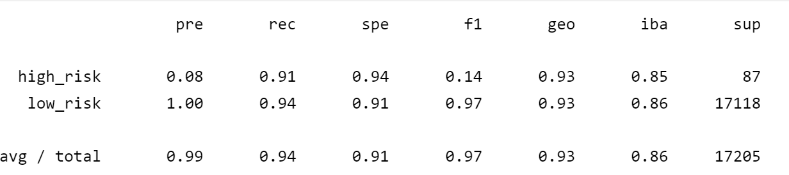

Based on above results, we know that  Easy Ensemble Model had the best balanced accuracy score 0.9263620468069506. Easy Ensemble Model had the best recall score. 0.91 for high risk and 0.94 for low risk.Easy Ensemble Model had the best geometric mean score 0.93.  Top three features are: total_rec_prncp, total_rec_int, and total_pymnt_inv.